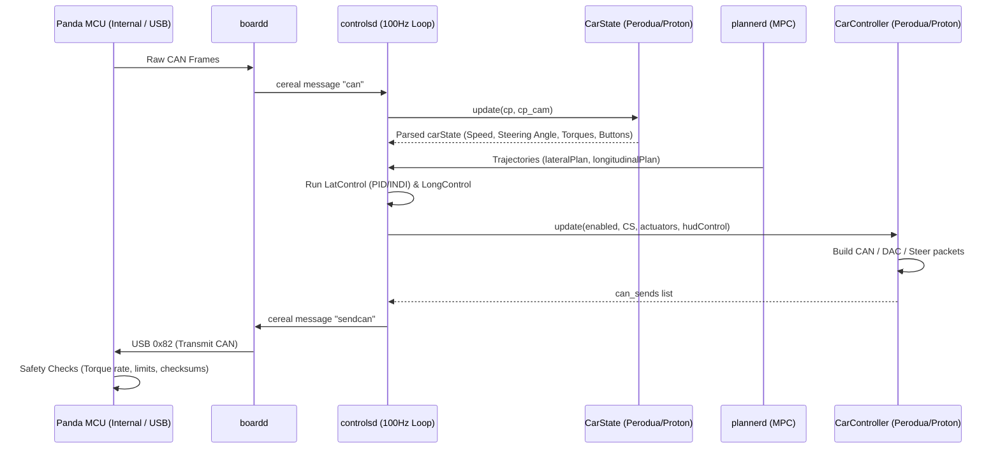
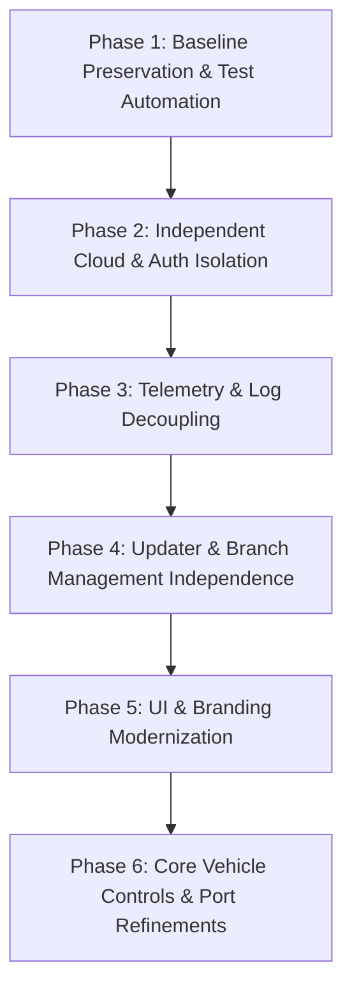

# Bukapilot K1S Architecture Audit

> **Branch Context:**
> - Frozen Baseline: `k1s-baseline` (KommuAI `ka1s_snapshot`, commit `e470f343c`)
> - Active Development Branch: `k1s-independent`
> - Mode: READ-ONLY Architecture Audit & Subsystem Inventory

---

## 1. Executive Summary & Repository Overview

Bukapilot K1S is a specialized fork of openpilot (based on openpilot ~0.8.x / LeEco EON architecture) tailored specifically for Malaysian vehicles (Perodua, Proton) and East Asian markets (BYD, Toyota/Lexus, Honda, Hyundai) on KommuAssist K1S hardware (Snapdragon 821 / EON NEOS 19.1 architecture with integrated interceptor / Panda MCU).

### Repository Directory Layout
- [`cereal/`](file:///Users/solehuddin/Documents/Projects/bukapilot-k1s/cereal): Cap'n Proto messaging schema definitions (`log.capnp`, `car.capnp`, `legacy.capnp`), IPC messaging wrappers, and VisionIPC library.
- [`opendbc/`](file:///Users/solehuddin/Documents/Projects/bukapilot-k1s/opendbc): CAN DBC definitions including proprietary additions (`perodua_general_pt.dbc`, `perodua_psd_pt.dbc`, `proton_general_pt.dbc`, `byd_general_pt.dbc`).
- [`panda/`](file:///Users/solehuddin/Documents/Projects/bukapilot-k1s/panda): Panda firmware source, interceptor board objects (`panda/board/obj/icptr.bin.signed`), and Python USB/CAN bindings.
- [`selfdrive/`](file:///Users/solehuddin/Documents/Projects/bukapilot-k1s/selfdrive): Core runtime daemon stack.
  - [`selfdrive/car/`](file:///Users/solehuddin/Documents/Projects/bukapilot-k1s/selfdrive/car): Vehicle abstraction layer (`perodua`, `proton`, `byd`, `toyota`, `honda`, `hyundai`, `chrysler`, `ford`, `gm`, `mazda`, `nissan`, `subaru`, `tesla`, `volkswagen`).
  - [`selfdrive/controls/`](file:///Users/solehuddin/Documents/Projects/bukapilot-k1s/selfdrive/controls): Real-time vehicle control loops, path planning, MPC solvers, and alert management.
  - [`selfdrive/boardd/`](file:///Users/solehuddin/Documents/Projects/bukapilot-k1s/selfdrive/boardd): Low-level CAN interface daemon communicating with Panda hardware.
  - [`selfdrive/ui/`](file:///Users/solehuddin/Documents/Projects/bukapilot-k1s/selfdrive/ui): Qt/C++ on-road and off-road UI application and sound daemon.
  - [`selfdrive/athena/`](file:///Users/solehuddin/Documents/Projects/bukapilot-k1s/selfdrive/athena): Cloud communication, RPC, and device registration.
  - [`selfdrive/loggerd/`](file:///Users/solehuddin/Documents/Projects/bukapilot-k1s/selfdrive/loggerd): Telemetry logging and cloud uploader.
  - [`selfdrive/hardware/`](file:///Users/solehuddin/Documents/Projects/bukapilot-k1s/selfdrive/hardware): Device-specific drivers and power management (EON/Android/NEOS vs TICI vs PC).
  - [`selfdrive/manager/`](file:///Users/solehuddin/Documents/Projects/bukapilot-k1s/selfdrive/manager): Process orchestration and supervisor daemon.
  - [`selfdrive/locationd/`](file:///Users/solehuddin/Documents/Projects/bukapilot-k1s/selfdrive/locationd): Live sensor calibration, Kalman filter, and parameter estimation.
- [`common/`](file:///Users/solehuddin/Documents/Projects/bukapilot-k1s/common): Shared utilities, real-time primitives, persistent parameters (`Params`), and Kommu API client helpers.
- [`tools/`](file:///Users/solehuddin/Documents/Projects/bukapilot-k1s/tools): Offline log analysis, plotting (`plotjuggler`), replay, and debugging tools.
- [`pyextra/`](file:///Users/solehuddin/Documents/Projects/bukapilot-k1s/pyextra) & [`third_party/`](file:///Users/solehuddin/Documents/Projects/bukapilot-k1s/third_party): Embedded libraries (ACADOS MPC solver, SNPE, OpenCL, json11, libyuv).

---

## 2. High-Level Architecture Map

```mermaid
flowchart TB
    subgraph Hardware ["Hardware Layer (K1S / EON)"]
        Cam[Camera Sensors]
        GPS[GPS / Sensors]
        PandaHW[Internal Panda / Interceptor MCU]
        VehCAN[(Vehicle CAN Busses 0, 1, 2)]
        TouchScreen[Touchscreen Display / Audio]
    end

    subgraph LowLevel ["I/O & Driver Daemons"]
        camerad[camerad]
        sensord[sensord / gpsd]
        pandad[pandad]
        boardd[boardd (Native)]
        soundd[soundd (Native)]
    end

    subgraph Perception ["Perception & Estimation"]
        modeld[modeld / dmonitoringmodeld]
        locationd[locationd / calibrationd]
        paramsd[paramsd]
        radard[radard]
    end

    subgraph PlanningControls ["Controls & Planning Layer (Real-time 100Hz)"]
        plannerd[plannerd / longitudinal_planner / lateral_planner]
        controlsd[controlsd (Controls Loop @ 100Hz)]
        carstate[CarState (Vehicle Parser)]
        carcontroller[CarController (Actuator Commands)]
        carinterface[CarInterface (Vehicle Abstraction)]
    end

    subgraph SystemUI ["UI & System Services"]
        manager[manager.py]
        ui[ui (Qt/C++)]
        thermald[thermald]
        updated[updated.py]
    end

    subgraph CloudServices ["Cloud & Telemetry (Kommu Infrastructure)"]
        athenad[athenad (manage_athenad)]
        uploader[loggerd / uploader.py]
        KommuAuth[Kommu Auth / RSJ API]
        KommuFIA[Kommu FIA Log Storage]
    end

    %% Connections
    Cam --> camerad --> modeld
    GPS --> sensord --> locationd
    PandaHW <--> boardd
    VehCAN <--> PandaHW
    pandad -.-> boardd

    boardd -- "can / pandaStates" --> controlsd
    boardd -- "can" --> radard
    modeld -- "modelV2 / driverState" --> plannerd
    modeld -- "modelV2" --> controlsd
    locationd -- "liveCalibration / liveLocationKalman" --> controlsd
    radard -- "radarState" --> plannerd
    radard -- "radarState" --> controlsd

    plannerd -- "lateralPlan / longitudinalPlan" --> controlsd

    controlsd --> carinterface
    carinterface --> carstate
    carinterface --> carcontroller
    carcontroller -- "sendcan" --> boardd

    controlsd -- "controlsState / carState / carEvents" --> ui
    controlsd -- "controlsState" --> soundd
    soundd --> TouchScreen
    ui --> TouchScreen

    manager --> SystemUI
    manager --> LowLevel
    manager --> Perception
    manager --> PlanningControls

    loggerd -- "logs / recordings" --> uploader
    uploader --> KommuFIA
    athenad <--> KommuAuth
```

---

## 3. Process & Daemon Catalog

Defined in [`selfdrive/manager/process_config.py`](file:///Users/solehuddin/Documents/Projects/bukapilot-k1s/selfdrive/manager/process_config.py) and managed by [`selfdrive/manager/manager.py`](file:///Users/solehuddin/Documents/Projects/bukapilot-k1s/selfdrive/manager/manager.py):

| Process Name | Type | Executable / Module | Target Platform | Description / Role | Safety Impact |
| :--- | :--- | :--- | :--- | :--- | :--- |
| `boardd` | Native | `selfdrive/boardd/boardd` | All (started via `pandad`) | High-speed CAN USB interface to Panda MCU; publishes `can`, receives `sendcan` | **SAFETY-CRITICAL** |
| `pandad` | Python | [`selfdrive.pandad`](file:///Users/solehuddin/Documents/Projects/bukapilot-k1s/selfdrive/pandad.py) | All | Flashes Panda firmware (`icptr.bin.signed`), resets MCU, manages USB connection, launches `boardd` | **SAFETY-CRITICAL** |
| `controlsd` | Python | [`selfdrive.controls.controlsd`](file:///Users/solehuddin/Documents/Projects/bukapilot-k1s/selfdrive/controls/controlsd.py) | All | Real-time vehicle control loop (100Hz). CarState, CarController, event handling, safety alerts | **SAFETY-CRITICAL** |
| `plannerd` | Python | [`selfdrive.controls.plannerd`](file:///Users/solehuddin/Documents/Projects/bukapilot-k1s/selfdrive/controls/plannerd.py) | All | Lateral and Longitudinal path planning using ACADOS MPC solvers (20Hz) | **SAFETY-CRITICAL** |
| `radard` | Python | [`selfdrive.controls.radard`](file:///Users/solehuddin/Documents/Projects/bukapilot-k1s/selfdrive/controls/radard.py) | All | Parses radar CAN messages into lead vehicle tracks | Vehicle-Critical |
| `camerad` | Native | `selfdrive/camerad/camerad` | EON / TICI | Captures frames from road/driver image sensors via Snapdragon ISP | **SAFETY-CRITICAL** |
| `modeld` | Native | `selfdrive/modeld/modeld` | All | Runs driving vision neural network (Supercombo via SNPE/DSP/GPU) | **SAFETY-CRITICAL** |
| `dmonitoringmodeld` | Native | `selfdrive/modeld/dmonitoringmodeld` | EON / TICI | Runs driver monitoring model (face/head pose, gaze) | Safety-Critical |
| `dmonitoringd` | Python | [`selfdrive.monitoring.dmonitoringd`](file:///Users/solehuddin/Documents/Projects/bukapilot-k1s/selfdrive/monitoring/dmonitoringd.py) | EON / TICI | Evaluates driver awareness, distraction, and eye contact | Safety-Critical |
| `sensord` | Native | `selfdrive/sensord/sensord` | EON / TICI | Reads IMU (gyro/accel), magnetometer, light sensor | Vehicle-Critical |
| `locationd` | Native | `selfdrive/locationd/locationd` | All | Localizer fusion daemon (Kalman filter) | Vehicle-Critical |
| `calibrationd` | Python | [`selfdrive.locationd.calibrationd`](file:///Users/solehuddin/Documents/Projects/bukapilot-k1s/selfdrive/locationd/calibrationd.py) | All | Computes camera pitch/yaw/roll mounting angles | Vehicle-Critical |
| `paramsd` | Python | [`selfdrive.locationd.paramsd`](file:///Users/solehuddin/Documents/Projects/bukapilot-k1s/selfdrive/locationd/paramsd.py) | All | Learns vehicle physical params (steer ratio, tire stiffness factor) | Vehicle-Critical |
| `ubloxd` | Native | `selfdrive/locationd/ubloxd` | Hardware | Parses raw u-blox GNSS data | Telemetry |
| `gpsd` | Native | `selfdrive/sensord/gpsd` | EON | Android GPS location interface | Telemetry |
| `ui` | Native | `selfdrive/ui/ui` | All | Qt/OpenGL driver UI, settings menu, onboarding, alerts display | UI / Operator Warning |
| `soundd` | Native | `selfdrive/ui/soundd/soundd` | All | Plays audible alerts (chimes, prompt tones, emergency takeover) | UI / Operator Warning |
| `thermald` | Python | [`selfdrive.thermald.thermald`](file:///Users/solehuddin/Documents/Projects/bukapilot-k1s/selfdrive/thermald/thermald.py) | All | Monitors SoC thermals, fan speed, battery voltage, ignition state | Hardware-Critical |
| `loggerd` | Native | `selfdrive/loggerd/loggerd` | All | Compresses and writes camera video segments and message logs | Telemetry |
| `deleter` | Python | [`selfdrive.loggerd.deleter`](file:///Users/solehuddin/Documents/Projects/bukapilot-k1s/selfdrive/loggerd/deleter.py) | All | Deletes old drive logs when disk space is low | Runtime Infrastructure |
| `uploader` | Python | [`selfdrive.loggerd.uploader`](file:///Users/solehuddin/Documents/Projects/bukapilot-k1s/selfdrive/loggerd/uploader.py) | All | Uploads drive segments to Kommu FIA storage | Telemetry / Cloud |
| `logmessaged` | Python | [`selfdrive.logmessaged`](file:///Users/solehuddin/Documents/Projects/bukapilot-k1s/selfdrive/logmessaged.py) | All | Relays swaglog socket messages to disk/cloud | Runtime Infrastructure |
| `tombstoned` | Python | [`selfdrive.tombstoned`](file:///Users/solehuddin/Documents/Projects/bukapilot-k1s/selfdrive/tombstoned.py) | EON / TICI | Catches native process crash dumps | Telemetry |
| `updated` | Python | [`selfdrive.updated`](file:///Users/solehuddin/Documents/Projects/bukapilot-k1s/selfdrive/updated.py) | Hardware | Safe OverlayFS updater against Git remote | Update Infrastructure |
| `manage_athenad` | Daemon | [`selfdrive.athena.manage_athenad`](file:///Users/solehuddin/Documents/Projects/bukapilot-k1s/selfdrive/athena/manage_athenad.py) | All | Manages persistent connection to Athena WebSocket RPC service | Cloud / Remote Mgmt |
| `statsd` | Python | [`selfdrive.statsd`](file:///Users/solehuddin/Documents/Projects/bukapilot-k1s/selfdrive/statsd.py) | All | Aggregates driving mileage, engagements, disengagements | Telemetry |
| `rtshield` | Python | [`selfdrive.rtshield`](file:///Users/solehuddin/Documents/Projects/bukapilot-k1s/selfdrive/rtshield.py) | EON | Reserves CPU core 3 for real-time control threads | Hardware-Critical |
| `androidd` | Python | [`selfdrive.hardware.eon.androidd`](file:///Users/solehuddin/Documents/Projects/bukapilot-k1s/selfdrive/hardware/eon/androidd.py) | EON | Monitors Android framework services and Qualcomm modem crashes | Hardware-Critical |
| `shutdownd` | Python | [`selfdrive.hardware.eon.shutdownd`](file:///Users/solehuddin/Documents/Projects/bukapilot-k1s/selfdrive/hardware/eon/shutdownd.py) | EON | Catches Android power-off / reboot signals and flushes buffers | Hardware-Critical |

---

## 4. Vehicle Interface Architecture & Flow

### End-to-End Control Flow Diagram



### CarState / CarController / CarInterface Lifecycle
1. **Fingerprinting & Instantiation** ([`selfdrive/car/car_helpers.py`](file:///Users/solehuddin/Documents/Projects/bukapilot-k1s/selfdrive/car/car_helpers.py)):
   - On ignition, `car_helpers.get_car()` attempts CAN message ID matching against known fingerprints (`_FINGERPRINTS`), OBD-II FW version queries (`match_fw_to_car`), or checks manual user override via `Params("FixFingerprint")`.
   - Imports dynamic port: `interfaces[candidate] -> (CarInterface, CarController, CarState)`.
   - Initializes `CarParams` via `CarInterface.get_params()`.
2. **Receiving & Parsing (100Hz)**:
   - `controlsd` calls `CarInterface.update(can_strings)`.
   - `cp.update_strings(can_strings)` updates CANParser based on DBC definitions.
   - `CarState.update(cp)` extracts wheel speeds, steering angle, driver torque, blinkers, brake press, gas pedal, ACC button state, and LKAS ready flags.
   - `CarInterface.create_common_events()` checks safety gates (door open, seatbelt unlatched, brake pressed, speed limits) and updates active state.
3. **Planning & Actuator Generation (100Hz / 20Hz)**:
   - `plannerd` generates future trajectory points and curvature.
   - `controlsd` compares current state against trajectory, evaluates `LatControlPID` / `LatControlINDI` to calculate required `steer` torque.
   - If longitudinal control is enabled, `LongControl` computes `gas` / `brake` / `accel`.
4. **Command Transmission**:
   - `controlsd` calls `CarInterface.apply(CarControl)`.
   - `CarController.update()` clamps torque deltas (`apply_perodua_steer_torque_limits`), applies standstill pump-reset algorithms, formats HUD commands, and packs CAN frames using `CANPacker`.
   - Frames are published to `sendcan`.
   - `boardd` forwards to Panda MCU via USB.

---

## 5. CAN & DBC Architecture

### DBC Files Inventory ([`opendbc/`](file:///Users/solehuddin/Documents/Projects/bukapilot-k1s/opendbc))
- **`perodua_general_pt.dbc`**: Standard Perodua powertrain DBC used for Axia, Bezza, Myvi Gen3 (pre-PSD), Aruz. Interfaces with KommuActuator DAC signals and stock EPS/ECU.
- **`perodua_psd_pt.dbc`**: Perodua Smart Drive (PSD) / DNGA platform DBC used for Ativa, Alza 2022+, Myvi 2022+ PSD, Toyota Vios (D92A/AC100), Toyota Veloz. Controls EPS steering torque and ESC brake pump via CAN.
- **`proton_general_pt.dbc`**: Geely/Proton CMA/BMA platform DBC used for Proton X50, S70, X70, X90. Intercepts LKA steering commands and ICC/ACC longitudinal commands.
- **`byd_general_pt.dbc`**: BYD e-Platform 3.0 DBC used for BYD Atto 3. Controls steering angle and HUD signals.
- Standard Openpilot DBCs: `toyota_tss2_adas.dbc`, `toyota_nodsu_pt_generated.dbc`, `honda_civic_touring_2016_can_generated.dbc`, `hyundai_kia_generic.dbc`, `vw_mqb_2010.dbc`, `nissan_x_trail_2017.dbc`, `subaru_global_2017_generated.dbc`.

### Panda Safety Hook Architecture
- In standard upstream openpilot, Panda safety modes (`SAFETY_TOYOTA`, `SAFETY_HONDA_NIDEC`, etc.) are compiled into the Panda STM32 firmware ([`panda/board/safety.h`](file:///Users/solehuddin/Documents/Projects/bukapilot-k1s/panda/board/safety.h)).
- In Bukapilot K1S:
  - The repo includes the precompiled interceptor firmware binary [`panda/board/obj/icptr.bin.signed`](file:///Users/solehuddin/Documents/Projects/bukapilot-k1s/panda/board/obj/icptr.bin.signed), configured via [`panda/python/config.py`](file:///Users/solehuddin/Documents/Projects/bukapilot-k1s/panda/python/config.py) (`DEFAULT_FW_FN`).
  - `cereal/car.capnp` defines safety models including `proton @26`, `perodua @27`, `wuling @28`, and `byd @29`.
  - `pandad.py` flashes `icptr.bin.signed` automatically to the Panda MCU if the signature mismatches.

---

## 6. Steering, LKA & Assisted Lane Change (ALC) Implementation

### Steering Control Pipelines
- **Torque-Based Control (Perodua PSD, Proton X50/S70/X70/X90, Toyota TSS2, Honda)**:
  - Subsystem: [`selfdrive/controls/lib/latcontrol_pid.py`](file:///Users/solehuddin/Documents/Projects/bukapilot-k1s/selfdrive/controls/lib/latcontrol_pid.py), [`selfdrive/car/perodua/carcontroller.py`](file:///Users/solehuddin/Documents/Projects/bukapilot-k1s/selfdrive/car/perodua/carcontroller.py), [`selfdrive/car/proton/carcontroller.py`](file:///Users/solehuddin/Documents/Projects/bukapilot-k1s/selfdrive/car/proton/carcontroller.py).
  - Rate limiting: Steering torque commands are subjected to ramp-up and ramp-down delta limits per frame (`STEER_DELTA_UP`, `STEER_DELTA_DOWN`).
  - Driver Override / Blinker attenuation: When a turn signal is active or driver applies torque, allowable torque limits are softened to allow smooth driver intervention without disengagement shock.
  - Smooth Resume Function (`reduce_steer` in [`controlsd.py`](file:///Users/solehuddin/Documents/Projects/bukapilot-k1s/selfdrive/controls/controlsd.py#L60-L68)): Non-linearly ramps steering torque back to 100% over 1.75 seconds after resume or lane change.
- **Angle-Based Control (BYD Atto 3)**:
  - Subsystem: [`selfdrive/controls/lib/latcontrol_angle.py`](file:///Users/solehuddin/Documents/Projects/bukapilot-k1s/selfdrive/controls/lib/latcontrol_angle.py), [`selfdrive/car/byd/interface.py`](file:///Users/solehuddin/Documents/Projects/bukapilot-k1s/selfdrive/car/byd/interface.py).
  - Commanded value: Steering angle in degrees, direct angle tracking.
- **Actuator / DAC Control (Perodua Non-PSD: Myvi Gen3, Axia, Bezza, Aruz)**:
  - Controlled by hardware KommuActuator via analog DAC channels.

### Assisted Lane Change (ALC) & Road-Edge Protection
- Implementation: [`selfdrive/controls/lib/desire_helper.py`](file:///Users/solehuddin/Documents/Projects/bukapilot-k1s/selfdrive/controls/lib/desire_helper.py).
- State Machine: `off` $\rightarrow$ `preLaneChange` $\rightarrow$ `laneChangeStarting` $\rightarrow$ `laneChangeFinishing`.
- Thresholds:
  - `LANE_CHANGE_SPEED_MIN = 30 MPH` (48.3 km/h).
  - `ALC_CANCEL_DELAY = 1.75s`.
  - `LANE_CHANGE_TIME_MAX = 10.0s`.
- Driver Nudge Requirement: Driver must signal and apply slight torque nudge in the direction of the turn signal to transition from `preLaneChange` to `laneChangeStarting`.
- Road Edge Blinker Invalidation: Uses neural network model road-edge confidence (`md.roadEdgeStds`) to inhibit lane changes into road shoulders/gutters.
- Low Speed Behavior: If turn signal is on below 30 MPH, lane keep assist is suppressed to allow natural manual cornering/turning.

---

## 7. Longitudinal Control & ACC Implementation

### Longitudinal Control Pipelines
1. **Full Openpilot Longitudinal (Perodua PSD: Ativa, Alza, Myvi PSD, Vios, Veloz)**:
   - MPC Solver: [`selfdrive/controls/lib/longitudinal_mpc_lib/`](file:///Users/solehuddin/Documents/Projects/bukapilot-k1s/selfdrive/controls/lib/longitudinal_mpc_lib) computes optimal acceleration trajectory.
   - PID Controller: [`selfdrive/controls/lib/longcontrol.py`](file:///Users/solehuddin/Documents/Projects/bukapilot-k1s/selfdrive/controls/lib/longcontrol.py).
   - PSD Braking & Standstill Pump Management ([`selfdrive/car/perodua/carcontroller.py`](file:///Users/solehuddin/Documents/Projects/bukapilot-k1s/selfdrive/car/perodua/carcontroller.py#L66-L105)):
     - Custom pump pulsing algorithm (`psd_brake`, `standstill_brake`) prevents hydraulic pump overheating and brake bleed when stationary.
     - Pulsing transitions between `STANDSTILL_INIT` $\rightarrow$ `BRAKE_HOLD` $\rightarrow$ `PUMP_RESET` on calibrated cycle timers.
2. **Proton ICC / Stock Longitudinal Integration (Proton X50, S70, X70, X90)**:
   - Proton models interface with stock ACC / ICC radar.
   - Bukapilot handles LKA while tracking vehicle ACC state, button pushes, and stop-and-go resume events.
3. **Stock Long Mode ("StockAcc" Feature Toggle)**:
   - Configurable via `Features().has("StockAcc")`. Decouples lateral lane keep from longitudinal control (MADS mode).

---

## 8. UI Architecture & Hardware Integration

### UI Architecture ([`selfdrive/ui/`](file:///Users/solehuddin/Documents/Projects/bukapilot-k1s/selfdrive/ui))
- Framework: Qt 5 (C++) with OpenGL ES rendering.
- UI Entry Point: `selfdrive/ui/main.cc` $\rightarrow$ `MainWindow` in [`selfdrive/ui/qt/window.cc`](file:///Users/solehuddin/Documents/Projects/bukapilot-k1s/selfdrive/ui/qt/window.cc).
- Screen Flow:
  - **Onboarding**: [`selfdrive/ui/qt/offroad/onboarding.cc`](file:///Users/solehuddin/Documents/Projects/bukapilot-k1s/selfdrive/ui/qt/offroad/onboarding.cc) displays Terms & Conditions ([`selfdrive/assets/offroad/tc.html`](file:///Users/solehuddin/Documents/Projects/bukapilot-k1s/selfdrive/assets/offroad/tc.html)) and Training Tutorial before first use.
  - **Home Window**: [`selfdrive/ui/qt/k_home.cc`](file:///Users/solehuddin/Documents/Projects/bukapilot-k1s/selfdrive/ui/qt/k_home.cc) & [`selfdrive/ui/qt/k_sidebar.cc`](file:///Users/solehuddin/Documents/Projects/bukapilot-k1s/selfdrive/ui/qt/k_sidebar.cc) with Kommu branding and alert badges.
  - **Settings Panel**: [`selfdrive/ui/qt/offroad/k_settings.cc`](file:///Users/solehuddin/Documents/Projects/bukapilot-k1s/selfdrive/ui/qt/offroad/k_settings.cc):
    - Toggles: Enable bukapilot, LDW, ALC, RHD, Quiet Mode, Wi-Fi Only Upload, Stock ACC.
    - Software Panel: Version display, update trigger, Git commit hash, `FeaturesControl` package selector, `FixFingerprintSelect`, and `ChangeBranchSelect`.
    - Network Panel: Wi-Fi / Hotspot setup, IP address display, SSH Key toggles.
  - **On-road Display**: [`selfdrive/ui/qt/onroad.cc`](file:///Users/solehuddin/Documents/Projects/bukapilot-k1s/selfdrive/ui/qt/onroad.cc) rendering camera feed, lane trajectories, lead distance, speed limit, and alerts.

### Device & Hardware Specific Code
- Hardware Abstraction: [`selfdrive/hardware/`](file:///Users/solehuddin/Documents/Projects/bukapilot-k1s/selfdrive/hardware) defines `HARDWARE` interface.
- **K1S / EON Platform (`EON`)**:
  - Snapdragon 821 (MSM8996), Android 6 / NEOS 19.1.
  - Core shielding: [`selfdrive/rtshield.py`](file:///Users/solehuddin/Documents/Projects/bukapilot-k1s/selfdrive/rtshield.py) locks CPU 3 for real-time control threads.
  - CPU governors & IRQ steering: Configured in [`launch_chffrplus.sh`](file:///Users/solehuddin/Documents/Projects/bukapilot-k1s/launch_chffrplus.sh) (e.g. CPU 1 for LTE modem/storage, CPU 2 for GPU/camerad, CPU 3 for USB/Panda).
  - Touchscreen rotation: `QT_QPA_EVDEV_TOUCHSCREEN_PARAMETERS=/dev/input/event1:rotate=90`.
  - Android helper service: [`selfdrive/hardware/eon/androidd.py`](file:///Users/solehuddin/Documents/Projects/bukapilot-k1s/selfdrive/hardware/eon/androidd.py) monitors system server, Qualcomm modem crashes (`/sys/devices/soc/2080000.qcom,mss/subsys5`).
  - Power shutdown handler: [`selfdrive/hardware/eon/shutdownd.py`](file:///Users/solehuddin/Documents/Projects/bukapilot-k1s/selfdrive/hardware/eon/shutdownd.py).
  - Setup APK auto-installer: [`install_neos_apk.sh`](file:///Users/solehuddin/Documents/Projects/bukapilot-k1s/install_neos_apk.sh) installs [`ai.comma.plus.neossetup.apk`](file:///Users/solehuddin/Documents/Projects/bukapilot-k1s/ai.comma.plus.neossetup.apk).

---

## 9. Updater, Network & Cloud Dependencies

### Updater Mechanism ([`selfdrive/updated.py`](file:///Users/solehuddin/Documents/Projects/bukapilot-k1s/selfdrive/updated.py))
- Runs in background offroad, periodically (every 10 minutes) performing `git fetch` in an isolated Linux OverlayFS staging area (`/data/safe_staging`).
- Gated by:
  - Clean working tree verification (`check_git_saved()`).
  - Target branch tracking (`@{u}`).
  - OverlayFS consistency file creation (`.overlay_consistent`).
- Swap on Boot: [`launch_chffrplus.sh`](file:///Users/solehuddin/Documents/Projects/bukapilot-k1s/launch_chffrplus.sh#L138-L171) checks `.overlay_consistent` and safely swaps `/data/safe_staging/finalized` into `/data/openpilot` with rollback backup (`old_openpilot`).
- In-App Branch Switcher ([`selfdrive/ui/qt/offroad/k_settings.h`](file:///Users/solehuddin/Documents/Projects/bukapilot-k1s/selfdrive/ui/qt/offroad/k_settings.h#L132-L160)): Changes Git upstream configuration directly via GUI and signals `updated.py`.

### Network, Auth & Cloud Infrastructure
- **Base Endpoint**: `https://web.kommu.ai` (configured in [`common/kommu.py`](file:///Users/solehuddin/Documents/Projects/bukapilot-k1s/common/kommu.py)).
- **Authentication / Device Registration**:
  - Module: [`selfdrive/athena/registration.py`](file:///Users/solehuddin/Documents/Projects/bukapilot-k1s/selfdrive/athena/registration.py) & [`selfdrive/athena/runescapej.py`](file:///Users/solehuddin/Documents/Projects/bukapilot-k1s/selfdrive/athena/runescapej.py).
  - Device ID (`DongleId`): `SHA224(IMEI + Serial)[:16]`.
  - Flow: Authenticates against Ory Kratos auth endpoints (`/self-service/login/api`, `/self-service/registration/api`) on `web.kommu.ai`. Stores session token in `Params("RsjSession")`.
  - Alert: If registration fails on official hardware, raises `Offroad_UnofficialHardware` off-road alert ([`alerts_offroad.json`](file:///Users/solehuddin/Documents/Projects/bukapilot-k1s/selfdrive/controls/lib/alerts_offroad.json)).
- **Telemetry & Video Log Uploads**:
  - Module: [`selfdrive/loggerd/uploader.py`](file:///Users/solehuddin/Documents/Projects/bukapilot-k1s/selfdrive/loggerd/uploader.py) and [`selfdrive/loggerd/kommu.py`](file:///Users/solehuddin/Documents/Projects/bukapilot-k1s/selfdrive/loggerd/kommu.py).
  - API: Requests pre-signed upload URLs via `GET https://web.kommu.ai/fia/get_upload_url`, then PUTs log slices to `https://web.kommu.ai/fia/...`.
  - Setting: `LogVideoWifiOnly` toggle allows user to restrict `qcamera.ts` uploads to Wi-Fi.
- **Athena Remote RPC**:
  - Module: [`selfdrive/athena/athenad.py`](file:///Users/solehuddin/Documents/Projects/bukapilot-k1s/selfdrive/athena/athenad.py) (default host `wss://athena.comma.ai` or overridable via `ATHENA_HOST`).
- **Crash Reporting**:
  - Module: [`selfdrive/sentry.py`](file:///Users/solehuddin/Documents/Projects/bukapilot-k1s/selfdrive/sentry.py). Inactive unless running on official comma remote and registered device.

---

## 10. Kommu Dependency Inventory

| Component / File | Specific Artifact / Symbol | Classification | Description & Functional Impact |
| :--- | :--- | :--- | :--- |
| [`panda/board/obj/icptr.bin.signed`](file:///Users/solehuddin/Documents/Projects/bukapilot-k1s/panda/board/obj/icptr.bin.signed) | Interceptor Panda binary | **Hardware-critical / Safety-critical** | Firmware flashed to K1S internal Panda MCU for CAN safety & signal injection. |
| [`common/kommu.py`](file:///Users/solehuddin/Documents/Projects/bukapilot-k1s/common/kommu.py) | `WEB_BASE = "https://web.kommu.ai"` | Cloud/API | Base client for Kratos session auth, JWT handling, and API proxy (`kapi`). |
| [`selfdrive/athena/runescapej.py`](file:///Users/solehuddin/Documents/Projects/bukapilot-k1s/selfdrive/athena/runescapej.py) | `register_user()`, `RSJ` | Authentication / Cloud | Registers hardware IMEI + serial with Kommu Kratos backend; derives `DongleId`. |
| [`selfdrive/athena/registration.py`](file:///Users/solehuddin/Documents/Projects/bukapilot-k1s/selfdrive/athena/registration.py) | `register()` | Authentication | Calls `runescapej.register_user()`, gates `Offroad_UnofficialHardware` alert. |
| [`selfdrive/loggerd/kommu.py`](file:///Users/solehuddin/Documents/Projects/bukapilot-k1s/selfdrive/loggerd/kommu.py) | `fia_upload()` | Telemetry / Cloud | Obtains FIA presigned URLs and uploads drive logs / crash logs to Kommu cloud. |
| [`selfdrive/loggerd/uploader.py`](file:///Users/solehuddin/Documents/Projects/bukapilot-k1s/selfdrive/loggerd/uploader.py) | `do_upload()` calling `fia_upload` | Telemetry / Cloud | Core log uploader loop adapted for Kommu S4/FIA format. |
| [`common/features.py`](file:///Users/solehuddin/Documents/Projects/bukapilot-k1s/common/features.py) | `Features` class | Runtime infrastructure | Bitmask feature package manager (`MyviAzri`, `StockAcc`, `LKSTactile`, etc.). |
| [`selfdrive/common/features.cc`](file:///Users/solehuddin/Documents/Projects/bukapilot-k1s/selfdrive/common/features.cc) | `Features` C++ mirror | Runtime infrastructure | C++ implementation of feature package parser for UI and native services. |
| [`selfdrive/car/perodua/carcontroller.py`](file:///Users/solehuddin/Documents/Projects/bukapilot-k1s/selfdrive/car/perodua/carcontroller.py) | `KommuActuator` DAC controls | Vehicle-critical | Gas & steering DAC command generator for non-CAN-controlled Perodua models. |
| [`selfdrive/ui/qt/k_home.cc`](file:///Users/solehuddin/Documents/Projects/bukapilot-k1s/selfdrive/ui/qt/k_home.cc) & [`k_sidebar.cc`](file:///Users/solehuddin/Documents/Projects/bukapilot-k1s/selfdrive/ui/qt/k_sidebar.cc) | Kommu UI Layout & Logos | UI/branding | Custom Qt home screen, sidebar icons, and tutorial tabs. |
| [`selfdrive/ui/qt/offroad/k_settings.cc`](file:///Users/solehuddin/Documents/Projects/bukapilot-k1s/selfdrive/ui/qt/offroad/k_settings.cc) | `FeaturesControl`, `FixFingerprintSelect` | UI/branding | Kommu custom settings panel, fingerprint selector, branch switcher. |
| [`selfdrive/assets/offroad/tc.html`](file:///Users/solehuddin/Documents/Projects/bukapilot-k1s/selfdrive/assets/offroad/tc.html) | KommuAssist Terms & Conditions | UI/branding | Legal onboarding document required to pass setup wizard. |
| [`build_release.sh`](file:///Users/solehuddin/Documents/Projects/bukapilot-k1s/build_release.sh) | `bot@blackhole.kommu.ai` | Build/development | Git author and packaging script for release generation. |

---

## 11. Safety-Critical Component Inventory

The following subsystems directly govern vehicle actuation, safety interlocks, or critical error detection. Any modification requires exhaustive verification against the AGENTS.md safety policy:

```
+-----------------------------------------------------------------------------------+
|                           SAFETY-CRITICAL SUBSYSTEMS                              |
+------------------------------------+----------------------------------------------+
| Subsystem                          | Key Files & Interfaces                       |
+------------------------------------+----------------------------------------------+
| Panda MCU Firmware & Safety        | panda/board/obj/icptr.bin.signed             |
|                                    | panda/board/safety.h, safety_declarations.h  |
|                                    | selfdrive/pandad.py                          |
|                                    | selfdrive/boardd/boardd.cc                   |
+------------------------------------+----------------------------------------------+
| 100Hz Real-Time Controls Loop      | selfdrive/controls/controlsd.py              |
|                                    | selfdrive/controls/lib/events.py             |
|                                    | selfdrive/controls/lib/alertmanager.py       |
+------------------------------------+----------------------------------------------+
| Lateral Controllers & Planners     | selfdrive/controls/lib/lateral_planner.py    |
|                                    | selfdrive/controls/lib/latcontrol_pid.py     |
|                                    | selfdrive/controls/lib/latcontrol_indi.py    |
|                                    | selfdrive/controls/lib/latcontrol_angle.py   |
|                                    | selfdrive/controls/lib/desire_helper.py      |
+------------------------------------+----------------------------------------------+
| Longitudinal Controllers & Planners| selfdrive/controls/lib/longitudinal_planner.py|
|                                    | selfdrive/controls/lib/longcontrol.py        |
+------------------------------------+----------------------------------------------+
| Vehicle Implementations (Perodua)  | selfdrive/car/perodua/interface.py           |
|                                    | selfdrive/car/perodua/carcontroller.py       |
|                                    | selfdrive/car/perodua/carstate.py            |
|                                    | selfdrive/car/perodua/peroduacan.py          |
+------------------------------------+----------------------------------------------+
| Vehicle Implementations (Proton)   | selfdrive/car/proton/interface.py            |
|                                    | selfdrive/car/proton/carcontroller.py        |
|                                    | selfdrive/car/proton/carstate.py             |
|                                    | selfdrive/car/proton/protoncan.py            |
+------------------------------------+----------------------------------------------+
| Vehicle Implementations (BYD)      | selfdrive/car/byd/interface.py               |
|                                    | selfdrive/car/byd/carcontroller.py           |
|                                    | selfdrive/car/byd/carstate.py                |
+------------------------------------+----------------------------------------------+
| Real-time Scheduling & Shielding   | selfdrive/rtshield.py                        |
|                                    | common/realtime.py                           |
+------------------------------------+----------------------------------------------+
```

---

## 12. Test Inventory & Verification Coverage

| Test File / Harness | Test Scope | Execution Method | Dependencies / Requirements |
| :--- | :--- | :--- | :--- |
| [`selfdrive/car/tests/test_car_interfaces.py`](file:///Users/solehuddin/Documents/Projects/bukapilot-k1s/selfdrive/car/tests/test_car_interfaces.py) | Instantiates all vehicle interfaces, validates `CarParams`, checks lateral tuning parameters, runs 10 dummy `update()` and `apply()` steps, checks radar interface | `python selfdrive/car/tests/test_car_interfaces.py` | Python 3.8, `parameterized`, `cereal` |
| [`selfdrive/test/test_fingerprints.py`](file:///Users/solehuddin/Documents/Projects/bukapilot-k1s/selfdrive/test/test_fingerprints.py) | Validates uniqueness and consistency across all CAN fingerprint definitions | `python selfdrive/test/test_fingerprints.py` | Python 3.8, `cereal` |
| [`selfdrive/manager/test/test_manager.py`](file:///Users/solehuddin/Documents/Projects/bukapilot-k1s/selfdrive/manager/test/test_manager.py) | Tests manager process lifecycle and startup configurations | `python selfdrive/manager/test/test_manager.py` | Python 3.8 |
| [`selfdrive/test/test_onroad.py`](file:///Users/solehuddin/Documents/Projects/bukapilot-k1s/selfdrive/test/test_onroad.py) | Full integration onroad test: executes openpilot for 2 segments, checks CPU budgets per process, service message timings, MPC solver time | `python selfdrive/test/test_onroad.py` | Requires built binaries or log replay |
| [`selfdrive/test/qc_test.py`](file:///Users/solehuddin/Documents/Projects/bukapilot-k1s/selfdrive/test/qc_test.py) | Quality control test: spoofs calibration & terms, verifies ignition response and thermals | `python selfdrive/test/qc_test.py` | Hardware or mocked messaging |
| [`common/kalman/tests/test_simple_kalman.py`](file:///Users/solehuddin/Documents/Projects/bukapilot-k1s/common/kalman/tests/test_simple_kalman.py) | Unit tests for 1D Kalman filter state estimator | `pytest common/kalman/tests/` | `pytest`, `numpy` |
| [`tools/lib/tests/test_readers.py`](file:///Users/solehuddin/Documents/Projects/bukapilot-k1s/tools/lib/tests/test_readers.py) | Tests log reading and parsing utilities | `pytest tools/lib/tests/` | `pytest` |

---

## 13. Recommended Modification & Decoupling Order

To systematically modernize the fork while maintaining absolute hardware compatibility with K1S and zero safety regressions:



### Phased Execution Strategy

1. **Phase 1: Baseline & Automated Test Hardening**
   - Ensure local tests (`test_car_interfaces.py`, `test_fingerprints.py`) run cleanly in CI and local environment.
   - Establish mock CAN harnesses for Perodua PSD and Proton BMA platforms to verify controller output deterministically.
2. **Phase 2: Authentication & Cloud Registration Decoupling**
   - Refactor [`selfdrive/athena/registration.py`](file:///Users/solehuddin/Documents/Projects/bukapilot-k1s/selfdrive/athena/registration.py) and [`selfdrive/athena/runescapej.py`](file:///Users/solehuddin/Documents/Projects/bukapilot-k1s/selfdrive/athena/runescapej.py) to remove mandatory Ory Kratos login requirements.
   - Allow standalone/offline mode without triggering `Offroad_UnofficialHardware` alerts.
3. **Phase 3: Telemetry & Logger Independence**
   - Decouple [`selfdrive/loggerd/uploader.py`](file:///Users/solehuddin/Documents/Projects/bukapilot-k1s/selfdrive/loggerd/uploader.py) and [`selfdrive/loggerd/kommu.py`](file:///Users/solehuddin/Documents/Projects/bukapilot-k1s/selfdrive/loggerd/kommu.py) from `web.kommu.ai/fia`.
   - Provide configurable self-hosted / local storage backends or clean opt-out toggles.
4. **Phase 4: Updater Modernization**
   - Update [`selfdrive/updated.py`](file:///Users/solehuddin/Documents/Projects/bukapilot-k1s/selfdrive/updated.py) and [`selfdrive/ui/qt/offroad/k_settings.h`](file:///Users/solehuddin/Documents/Projects/bukapilot-k1s/selfdrive/ui/qt/offroad/k_settings.h) to point to the independent GitHub repository (`studlolox/bukapilot-k1s` / `k1s-independent`) instead of upstream Kommu repositories.
5. **Phase 5: UI, Features & Settings Clean-up**
   - Clean up UI branding in [`selfdrive/ui/qt/k_sidebar.cc`](file:///Users/solehuddin/Documents/Projects/bukapilot-k1s/selfdrive/ui/qt/k_sidebar.cc), [`selfdrive/ui/qt/k_home.cc`](file:///Users/solehuddin/Documents/Projects/bukapilot-k1s/selfdrive/ui/qt/k_home.cc), and [`selfdrive/assets/offroad/tc.html`](file:///Users/solehuddin/Documents/Projects/bukapilot-k1s/selfdrive/assets/offroad/tc.html).
   - Streamline `Features` bitmask management into native persistent parameters.
6. **Phase 6: Vehicle Control & Port Tuning**
   - With infrastructure decoupled and stability verified, address vehicle-specific enhancements (Perodua, Proton, BYD) adhering strictly to the AGENTS.md Safety-Critical Software Policy.
