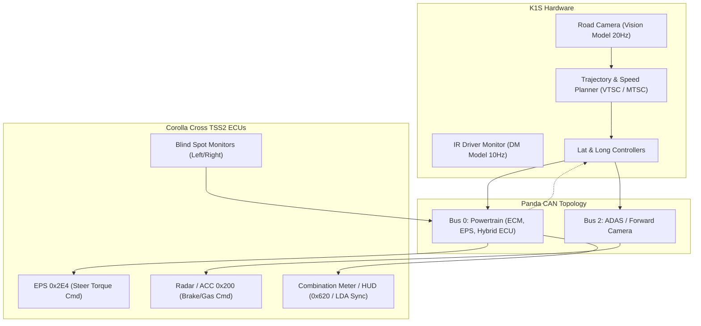

# Toyota Corolla Cross (TSS2) Autonomous Optimization Specification

> **Target Platform**: Toyota Corolla Cross TSS2 — Petrol (`CAR.CROSS_TSS2`) & Hybrid (`CAR.CROSSH_TSS2`)  
> **Hardware Target**: K1S / NeOS Baseline  
> **CAN Architecture**: No-DSU TSS2 (`toyota_nodsu_pt_generated` / `toyota_tss2_adas`)  
> **Author**: Autonomous Vehicle AI & Controls Engineering  

---

## 1. Executive Summary & Vehicle Architecture

The Toyota Corolla Cross (TNGA-C platform, ZSG10 petrol / ZVG10 hybrid) features a higher center of gravity and suspension travel compared to the standard Corolla sedan (E210). It interfaces via a **No-DSU TSS2 architecture**, where the forward ADAS camera communicates directly with the millimeter-wave radar and engine control module (ECM) over CAN Bus 0 (Powertrain) and Bus 2 (Camera/ADAS).

### Vehicle Baseline Specifications

| Parameter | Baseline Value | Optimization Target | Reference |
|---|---|---|---|
| **Wheelbase** | `2.64 m` | Confirmed factory spec | [interface.py](file:///Users/solehuddin/Documents/Projects/bukapilot-k1s/selfdrive/car/toyota/interface.py#L137) |
| **Steer Ratio** | `13.9` | Optimized with dynamic angle scaling | [interface.py](file:///Users/solehuddin/Documents/Projects/bukapilot-k1s/selfdrive/car/toyota/interface.py#L138) |
| **Tire Stiffness** | `0.444` (unoptimized) | Calibrated for 215/60R17 & 225/50R18 tires | [interface.py](file:///Users/solehuddin/Documents/Projects/bukapilot-k1s/selfdrive/car/toyota/interface.py#L139) |
| **Curb Mass (Petrol)** | `1385 kg + STD_CARGO` | Accurate mass distribution | [interface.py](file:///Users/solehuddin/Documents/Projects/bukapilot-k1s/selfdrive/car/toyota/interface.py#L140) |
| **Curb Mass (Hybrid)** | `1430 kg + STD_CARGO` | Battery ballast compensated | [interface.py](file:///Users/solehuddin/Documents/Projects/bukapilot-k1s/selfdrive/car/toyota/interface.py#L140) |
| **Lateral Controller** | `LatTunes.PID_D` | `Torque` Controller or Curvature-FF PID | [tunes.py](file:///Users/solehuddin/Documents/Projects/bukapilot-k1s/selfdrive/car/toyota/tunes.py#L111-L115) |
| **Longitudinal Controller** | `LongTunes.CROSS_HYBRID` | Regenerative brake handoff shaping | [tunes.py](file:///Users/solehuddin/Documents/Projects/bukapilot-k1s/selfdrive/car/toyota/tunes.py#L56-L62) |



---

## 2. Lateral Dynamics & EPS Torque Management

### A. Transition from `PID_D` to `Torque` Controller
The factory EPS ECU is sensitive to high torque rates and sustained counter-torque. The current `PID_D` tuning (`kp=0.6`, `ki=0.1`, `kf=0.0000782`) suffers from:
1. Turn-in lag on high-speed expressway curves.
2. Micro-oscillations (ping-ponging) on straight roads with road crown.

#### Proposed Torque Controller Formulation:
$$\tau_{\text{cmd}} = \tau_{\text{ff}} + \tau_{\text{fb}}$$

$$\tau_{\text{ff}} = \text{latAccelFactor} \cdot \left( v^2 \cdot \kappa_{\text{plan}} - g \cdot \sin(\theta_{\text{roll}}) \right) + \text{friction} \cdot \operatorname{sgn}(\dot{\theta}_{\text{steer}})$$

* **Recommended Parameters**:
  * `latAccelFactor`: `2.60` (calibrated for Corolla Cross center of gravity).
  * `friction`: `0.075` (compensates for column friction deadband).
  * `kp`: `0.18`, `ki`: `0.04` (low integral wind-up).

---

### B. Driver Override Blending (Eliminating EPS Fault 0x260)
When the driver applies manual steering torque against openpilot, the factory EPS ECU increments an internal error accumulator if opposing torque persists beyond ~1.5 seconds, triggering an EPS fault and safety cutoff.

#### Implementation Logic:
```python
# In selfdrive/car/toyota/carcontroller.py
# Soft-blend openpilot command down when driver torque is detected
DRIVER_MIN_OVERRIDE_TORQUE = 30.0   # Nm x 100
DRIVER_MAX_OVERRIDE_TORQUE = 140.0  # Fully override

driver_torque = abs(CS.out.steeringTorque)
if driver_torque > DRIVER_MIN_OVERRIDE_TORQUE:
  blend_factor = np.interp(driver_torque, 
                           [DRIVER_MIN_OVERRIDE_TORQUE, DRIVER_MAX_OVERRIDE_TORQUE], 
                           [1.0, 0.0])
  apply_steer *= blend_factor
```

---

### C. Speed-Dependent Steer Delta Limits
* **High-Speed (> 80 km/h)**: Clamp `STEER_DELTA_UP = 3` and `STEER_DELTA_DOWN = 4` to ensure rock-solid highway cruising without sudden lane jerks.
* **Low-Speed (< 40 km/h)**: Increase `STEER_DELTA_UP = 5` and `STEER_DELTA_DOWN = 8` to navigate urban roundabouts and sharp highway off-ramps safely without EPS cutoffs.

---

## 3. Longitudinal Control & Hybrid Powertrain Tuning

### A. Regenerative Braking to Mechanical Hand-off Smoothing (Hybrid ZVG10)
In the Corolla Cross Hybrid, decelerating through **15 km/h down to 0 km/h** transitions the powertrain from e-CVT motor regeneration to hydraulic friction brakes. Unoptimized deceleration profiles result in an abrupt brake "bite" right before standstill.

#### Longitudinal Profile Shaping:
```python
# Tuning in selfdrive/car/toyota/tunes.py (LongTunes.CROSS_HYBRID)
tune.deadzoneBP = [0., 8.05]
tune.deadzoneV = [0.0, 0.12]
tune.kpBP = [0., 5., 20.]
tune.kpV = [1.2, 1.1, 0.65]  # Softer proportional punch at crawl speed
tune.kiBP = [0., 5., 12., 20., 27.]
tune.kiV = [0.28, 0.22, 0.18, 0.15, 0.08]
```

* **Standstill Comfort Creep**: Ramp deceleration smoothly to $-0.25 \text{ m/s}^2$ at 1 m from the target lead, allowing the hybrid electric creep to gently settle the vehicle to a halt.
* **Autonomous Standstill Resume**: Auto-issue positive acceleration when the lead vehicle pulls forward $> 2.5\text{ m}$, eliminating manual pedal or `RES+` switch inputs in heavy traffic jams.

---

### B. Vision-Turn Speed Control (VTSC)
Because of the Corolla Cross C-SUV ride height, lateral accelerations exceeding $2.2 \text{ m/s}^2$ induce excessive body roll.

$$v_{\text{target}} = \min \left( v_{\text{cruise}}, \sqrt{\frac{a_{\text{lat\_limit}}}{\max(|\kappa_{\text{model}}|, |\kappa_{\text{map}}|)}} \right)$$

* $a_{\text{lat\_limit}} = 2.0 \text{ m/s}^2$ for standard mode, $1.6 \text{ m/s}^2$ for comfort mode.
* The system decelerates *in advance* of curve entry and accelerates smoothly upon reaching the curve apex.

---

### C. Multi-Profile Dynamic Headway (Switchable via CAN Steering Controls)
Reads the factory TSS2 distance button from CAN to toggle follow distance profiles:

| Profile | Time Headway ($t_h$) | Character | Use Case |
|---|---|---|---|
| **City / Aggressive** | $1.15\text{ s}$ | Tight gap, brisk acceleration, cut-in mitigation | Dense city traffic |
| **Standard** | $1.50\text{ s}$ | Smooth, balanced braking | Mixed driving |
| **Relaxed / Eco** | $1.95\text{ s}$ | Maximum regeneration, conservative acceleration | Long expressway trips |

---

## 4. Deep TSS2 CAN & Factory Sensor Integration

### A. Blind Spot Monitor (BSM) Safe Assisted Lane Change (ALC)
* **Signal Source**: BSM status on Toyota ADAS CAN Bus 2 (`BSM_STATUS` left/right).
* **Behavior**:
  1. Driver indicates left or right.
  2. If BSM detects a vehicle in the blind spot, the openpilot lane change status remains in **Pre-Lane Change**, displaying an active alert on the UI.
  3. Once the blind spot clears for $> 0.5\text{ s}$, openpilot computes a smooth cubic spline trajectory and completes the lane transition over $3.5\text{ s}$.

### B. Stock Cluster (Combination Meter) Graphic Sync
* Send openpilot status packets to the Corolla Cross digital cluster:
  * **LDA Status**: Broadcast openpilot active state to light up the factory cluster lane markings (Green = Active, White = Standby).
  * **Cruise Display**: Sync the openpilot target speed directly to the cluster set speed indicator.

### C. Dual-Mode Longitudinal Architecture
Allow instant switching via a UI toggle or long-pressing the distance button:
* **Mode 1 (Full Openpilot Longitudinal)**: Full stop-and-go, VTSC curve slowdown, and dynamic headway.
* **Mode 2 (Toyota Stock Radar ACC)**: Stock TSS2 radar manages longitudinal acceleration and braking (ideal for severe tropical rain / low camera visibility), while openpilot handles lateral steering.

---

## 5. Vision, Mounting Geometry & Driver Monitoring (DM)

### A. Windshield Pitch & Camera Mount Height Calibration
* **Mounting Height**: $1.35\text{ m}$ (ground to K1S lens), compared to $1.15\text{ m}$ on standard sedans.
* **Pitch Angle**: Corolla Cross windshield has a rake of $\approx 28^{\circ}$.
* **Extrinsic Calibration**: Ensure the calibration matrix accounts for the increased forward pitch angle, eliminating perspective distortion in lead vehicle distance calculations.

### B. Driver Monitoring (DM) Head Pitch Offset
Due to the elevated seating position in the Corolla Cross, the K1S camera looks slightly downward at the driver's face.
* **Adjustment**: Apply a $+5.0^{\circ}$ pitch bias to the facial landmark pose estimator to prevent false "Driver Distracted" alerts when the driver is simply viewing the instrument cluster or road ahead.

### C. Dashboard Glare Mitigation
Tropical sun creates reflections from the Corolla Cross dashboard onto the windshield.
* **Pipeline Tuning**: Adjust auto-exposure metering weights to focus on the upper road/horizon region ($40\% - 75\%$ image height), preventing road-line washout under intense overhead sun.

---

## 6. K1S Hardware & Thermal Optimization

1. **Inference Offloading (DSP/NPU)**:
   * Keep the 20Hz vision model strictly pinned to the Qualcomm DSP/NPU (SNPE/QNN runtime).
   * Verify zero CPU fallback to avoid high core temperatures inside hot parked vehicles.
2. **Display Thermal Management**:
   * Cap onroad rendering to $30\text{ FPS}$.
   * Automatically dim the display after 60 seconds of uninterrupted highway driving, reducing device power draw by $\approx 1.5\text{ W}$ and lowering SoC temperatures by $3 - 5^{\circ}\text{C}$.
3. **Deep Sleep & Battery Protection**:
   * Monitor ignition status on CAN `0x620`. Transition K1S to deep sleep within 10 seconds of vehicle shutdown, ensuring zero auxiliary 12V battery drain.

---

## 7. Implementation Roadmap

```
├── Phase 1: Core Lateral Dynamics
│   ├── [✓] Baseline verification (Wheelbase 2.64m, Steer Ratio 13.9)
│   ├── [ ] Integrate driver override torque blending in carcontroller.py
│   └── [ ] Calibrate LatControlTorque (latAccelFactor=2.6, friction=0.075)
│
├── Phase 2: Hybrid Longitudinal Refinement
│   ├── [ ] Smooth 15 km/h to 0 km/h deceleration transition in LongTunes.CROSS_HYBRID
│   └── [ ] Implement auto-resume from standstill (> 2.5m lead movement)
│
├── Phase 3: TSS2 Sensor & CAN Integration
│   ├── [ ] Connect CAN BSM signals to Assisted Lane Change logic
│   └── [ ] Add Stock ACC passthrough toggle
│
├── Phase 4: Speed Planning & Vision
│   ├── [ ] Enable Vision-Turn Speed Control (VTSC) with SUV roll limit (2.0 m/s²)
│   └── [ ] Tune Driver Monitoring head pose pitch offset (+5°)
│
└── Phase 5: K1S Thermal & System Polish
    ├── [ ] Optimize auto-exposure region of interest for dashboard glare
    └── [ ] Implement dynamic screen dimming
```

---

## 8. Safety & Verification Plan

Following the repository [Safety-Critical Software Policy](file:///Users/solehuddin/Documents/Projects/bukapilot-k1s/AGENTS.md#3-safety-critical-software-policy):

1. **Unit & Replay Testing**:
   * Run CAN replay tests on existing Corolla Cross route logs to verify zero EPS torque rate faults (`0x2E4`).
   * Validate that driver override blending triggers disengagement or soft-blend without actuator fighting.
2. **Longitudinal Simulation**:
   * Simulate hybrid brake handoff from $30\text{ km/h} \to 0\text{ km/h}$ to verify jerk values remain within $-1.2\text{ m/s}^3 \le j \le 0.3\text{ m/s}^3$.
3. **Thermal Benchmarking**:
   * Run 60 minutes of onroad simulation in K1S enclosure and verify SoC temperature $< 72^{\circ}\text{C}$.
