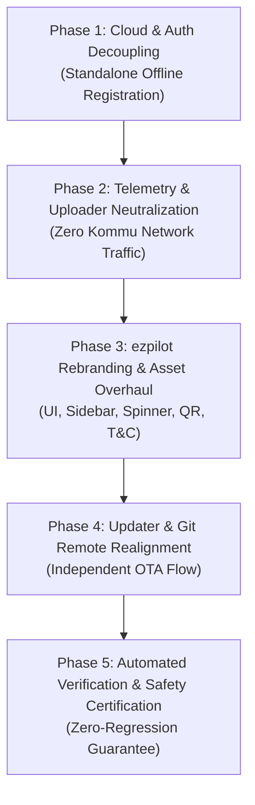

# ezpilot — K1S Independent Fork Architecture Analysis & Migration Plan

> **Project Identity:** `ezpilot`  
> **Target Hardware:** KommuAssist K1S (Snapdragon 821 MSM8996, NEOS 19.1 / Android 6)  
> **Active Development Branch:** `k1s-independent`  
> **Canonical Reference Baseline:** `k1s-baseline` (Frozen upstream snapshot: KommuAI `ka1s_snapshot` @ `e470f343c`)  
> **Safety Policy:** Governed by [`AGENTS.md`](file:///Users/solehuddin/Documents/Projects/bukapilot-k1s/AGENTS.md)

---

## 1. Executive Summary

`ezpilot` is an independent open-source fork of Bukapilot / openpilot 0.8 designed to run natively on KommuAssist K1S hardware. The objective of this fork is twofold:
1. **Sever all external dependencies on Kommu cloud infrastructure** (cloud authentication, telemetry upload, remote telemetry RPC, and vendor locking).
2. **Rebrand the user interface and operating experience to `ezpilot`** while preserving complete hardware safety, vehicle compatibility, and actuator control logic for Malaysian and East Asian vehicles (Perodua, Proton, BYD, Toyota, Honda).

---

## 2. Current Build & System Architecture Analysis

```mermaid
flowchart TB
    subgraph Hardware ["K1S Hardware Layer"]
        Cam[Camera Sensors Road/Driver]
        PandaHW[Integrated Panda MCU]
        VehCAN[(Vehicle CAN Busses 0, 1, 2)]
        DAC[KommuActuator Analog DAC]
        Screen[Touchscreen / Sound]
    end

    subgraph LowLevel ["Native Daemons"]
        camerad[camerad]
        sensord[sensord / gpsd]
        boardd[boardd (CAN USB)]
        soundd[soundd (Audio)]
    end

    subgraph ControlsPlanning ["Controls & Planning (100Hz Loop)"]
        pandad[pandad (Flashes icptr.bin.signed)]
        controlsd[controlsd]
        plannerd[plannerd (ACADOS MPC)]
        carinterface[CarInterface / CarController / CarState]
    end

    subgraph UIApp ["ezpilot UI Stack"]
        manager[manager.py]
        ui[ui (Qt5 C++ / OpenGL)]
        updated[updated.py (Safe Staging Updater)]
    end

    subgraph IsolatedCloud ["Decoupled Cloud & Telemetry Layer"]
        reg[Standalone Dongle Registration]
        deleter[deleter.py (Local Storage Auto-Prune)]
        uploader[uploader.py (Disabled / Local-Only)]
    end

    Cam --> camerad --> controlsd
    VehCAN <--> PandaHW <--> boardd <--> controlsd
    DAC <--> PandaHW
    pandad -.-> boardd
    controlsd <--> carinterface
    plannerd <--> controlsd
    controlsd --> soundd --> Screen
    controlsd --> ui --> Screen
    manager --> LowLevel
    manager --> ControlsPlanning
    manager --> UIApp
    manager --> IsolatedCloud
```

### A. Hardware Platform & Operating Environment
* **System-on-Chip (SoC):** Qualcomm Snapdragon 821 (MSM8996 quad-core Kryo).
* **Operating System:** Comma NEOS 19.1 (stripped Android 6.0 Marshmallow kernel + Termux GNU/Linux userspace).
* **Real-time CPU Isolation:** [`selfdrive/rtshield.py`](file:///Users/solehuddin/Documents/Projects/bukapilot-k1s/selfdrive/rtshield.py) and [`launch_chffrplus.sh`](file:///Users/solehuddin/Documents/Projects/bukapilot-k1s/launch_chffrplus.sh) lock CPU Core 3 strictly for real-time CAN and controls threads, steering IRQs away to cores 0–2.
* **MCU & Interceptor:** STM32 Panda MCU embedded directly into the K1S casing. Flashed automatically during startup by [`selfdrive/pandad.py`](file:///Users/solehuddin/Documents/Projects/bukapilot-k1s/selfdrive/pandad.py) with the pre-compiled signed binary [`panda/board/obj/icptr.bin.signed`](file:///Users/solehuddin/Documents/Projects/bukapilot-k1s/panda/board/obj/icptr.bin.signed).

### B. Vehicle Control Stack
* **Perodua Smart Drive (PSD / DNGA):** (Ativa, Alza 2022+, Myvi 2022+ PSD, Toyota Vios AC100/Veloz). Direct CAN bus control of Electric Power Steering (EPS) and continuous cyclic brake pump pulsing to prevent hydraulic lockups.
* **Perodua Non-PSD (Legacy):** (Axia, Bezza, Myvi Gen3 pre-PSD, Aruz). Controls throttle and steering via the analog DAC interceptor (`KommuActuator`).
* **Proton (Geely BMA/CMA):** (X50, S70, X70, X90). CAN steering torque overlay interfacing with factory Bosch/Geely ACC radar and LKAS camera.
* **BYD:** (Atto 3). Direct angle-based steering control over CAN.

### C. Build System & Compilation Flow
* **On-Device:** [`selfdrive/manager/build.py`](file:///Users/solehuddin/Documents/Projects/bukapilot-k1s/selfdrive/manager/build.py) executes `scons -j3` on boot if no `prebuilt` marker file exists.
* **Development Container:** Containerized development via [`Dockerfile.k1s-dev`](file:///Users/solehuddin/Documents/Projects/bukapilot-k1s/Dockerfile.k1s-dev) targeting Python 3.8 and Ubuntu 20.04 with pre-configured Cython and Cap'n Proto toolchains.

---

## 3. Kommu Dependencies & Decoupling Inventory

The codebase currently has external connections and vendor branding spread across four distinct functional areas:

| Area | Affected File(s) | Existing Kommu Mechanism | `ezpilot` Target State |
| :--- | :--- | :--- | :--- |
| **Authentication & Registration** | [`selfdrive/athena/registration.py`](file:///Users/solehuddin/Documents/Projects/bukapilot-k1s/selfdrive/athena/registration.py)<br>[`selfdrive/athena/runescapej.py`](file:///Users/solehuddin/Documents/Projects/bukapilot-k1s/selfdrive/athena/runescapej.py)<br>[`common/kommu.py`](file:///Users/solehuddin/Documents/Projects/bukapilot-k1s/common/kommu.py) | Contacts `https://web.kommu.ai/self-service/registration/api` using IMEI/Serial; raises `Offroad_UnofficialHardware` alert if registration fails. | Compute deterministic `DongleId` locally using `SHA224(IMEI + Serial)[:16]`. Fully offline-capable. Suppress unauthenticated hardware alerts. |
| **Telemetry & Uploads** | [`selfdrive/loggerd/uploader.py`](file:///Users/solehuddin/Documents/Projects/bukapilot-k1s/selfdrive/loggerd/uploader.py)<br>[`selfdrive/loggerd/kommu.py`](file:///Users/solehuddin/Documents/Projects/bukapilot-k1s/selfdrive/loggerd/kommu.py) | Uploads camera segments and logs to Kommu FIA storage (`https://web.kommu.ai/fia/...`). | Disable cloud uploads by default. Preserve [`selfdrive/loggerd/deleter.py`](file:///Users/solehuddin/Documents/Projects/bukapilot-k1s/selfdrive/loggerd/deleter.py) circular disk buffer management. |
| **Remote RPC Daemon** | [`selfdrive/athena/manage_athenad.py`](file:///Users/solehuddin/Documents/Projects/bukapilot-k1s/selfdrive/athena/manage_athenad.py)<br>[`selfdrive/manager/process_config.py`](file:///Users/solehuddin/Documents/Projects/bukapilot-k1s/selfdrive/manager/process_config.py) | Attempts persistent WebSocket connection to Comma/Kommu backends. | Set to passive/disabled mode unless user explicitly configures a self-hosted endpoint. |
| **UI & Visual Branding** | [`selfdrive/ui/qt/k_home.cc`](file:///Users/solehuddin/Documents/Projects/bukapilot-k1s/selfdrive/ui/qt/k_home.cc)<br>[`selfdrive/ui/qt/k_sidebar.cc`](file:///Users/solehuddin/Documents/Projects/bukapilot-k1s/selfdrive/ui/qt/k_sidebar.cc)<br>[`selfdrive/ui/qt/spinner.cc`](file:///Users/solehuddin/Documents/Projects/bukapilot-k1s/selfdrive/ui/qt/spinner.cc)<br>[`selfdrive/assets/kommu/*`](file:///Users/solehuddin/Documents/Projects/bukapilot-k1s/selfdrive/assets/kommu)<br>[`selfdrive/assets/spinner/*`](file:///Users/solehuddin/Documents/Projects/bukapilot-k1s/selfdrive/assets/spinner)<br>[`selfdrive/assets/offroad/tc.html`](file:///Users/solehuddin/Documents/Projects/bukapilot-k1s/selfdrive/assets/offroad/tc.html) | Renders Kommu logos, "Pair with KommuApp" QR code, 30-frame Kommu loading spinner, and Kommu.ai Sdn Bhd Terms and Conditions. | Rebrand UI labels to **ezpilot**. Replace sidebar logo and loading spinner with clean ezpilot assets. Replace pairing QR with local device status. Modernize T&C. |
| **Updater & Git Remote** | [`selfdrive/updated.py`](file:///Users/solehuddin/Documents/Projects/bukapilot-k1s/selfdrive/updated.py)<br>[`selfdrive/ui/qt/offroad/k_settings.h`](file:///Users/solehuddin/Documents/Projects/bukapilot-k1s/selfdrive/ui/qt/offroad/k_settings.h)<br>[`build_release.sh`](file:///Users/solehuddin/Documents/Projects/bukapilot-k1s/build_release.sh) | Tracks upstream Kommu git remotes; `build_release.sh` uses `bot@blackhole.kommu.ai`. | Point Git remotes to `ezpilot` repository. Update release scripts with fork maintainer identity. |
| **Hardware Compatibility** | [`selfdrive/car/perodua/carcontroller.py`](file:///Users/solehuddin/Documents/Projects/bukapilot-k1s/selfdrive/car/perodua/carcontroller.py)<br>[`opendbc/perodua_general_pt.dbc`](file:///Users/solehuddin/Documents/Projects/bukapilot-k1s/opendbc/perodua_general_pt.dbc) | Signal comments referencing `KommuActuator` DAC interface. | **PRESERVE INTACT.** These represent physical CAN and analog hardware protocols. Modifying them violates safety rules. |

---

## 4. ezpilot Phased Implementation Plan



### Phase 1: Standalone Authentication & Hardware Independence `[COMPLETED]`
* **Objective:** Enable the device to boot and operate completely standalone without internet access or reliance on `web.kommu.ai`.
* **Actions:**
  1. Refactor [`selfdrive/athena/registration.py`](file:///Users/solehuddin/Documents/Projects/bukapilot-k1s/selfdrive/athena/registration.py):
     - Compute the device `DongleId` deterministically from hardware serial and IMEI (`SHA224(IMEI + Serial)[:16]`).
     - Remove the blocking network loop calling `runescapej.register_user()`.
     - Disable the `Offroad_UnofficialHardware` alert in [`alerts_offroad.json`](file:///Users/solehuddin/Documents/Projects/bukapilot-k1s/selfdrive/controls/lib/alerts_offroad.json).
  2. Isolate [`selfdrive/athena/runescapej.py`](file:///Users/solehuddin/Documents/Projects/bukapilot-k1s/selfdrive/athena/runescapej.py) and [`common/kommu.py`](file:///Users/solehuddin/Documents/Projects/bukapilot-k1s/common/kommu.py) from the core startup path.

### Phase 2: Telemetry & Logging Neutralization `[COMPLETED]`
* **Objective:** Ensure no driving video, CAN logs, or diagnostic traces are transmitted to external Kommu servers.
* **Actions:**
  1. In [`selfdrive/loggerd/uploader.py`](file:///Users/solehuddin/Documents/Projects/bukapilot-k1s/selfdrive/loggerd/uploader.py) and [`selfdrive/loggerd/kommu.py`](file:///Users/solehuddin/Documents/Projects/bukapilot-k1s/selfdrive/loggerd/kommu.py):
     - Bypass `fia_upload()` so network requests to `web.kommu.ai/fia` are eliminated.
     - Tag files locally to prevent infinite upload retry loops.
  2. Confirm [`selfdrive/loggerd/deleter.py`](file:///Users/solehuddin/Documents/Projects/bukapilot-k1s/selfdrive/loggerd/deleter.py) operates unimpeded to recycle storage space on K1S flash memory.
  3. In [`selfdrive/manager/process_config.py`](file:///Users/solehuddin/Documents/Projects/bukapilot-k1s/selfdrive/manager/process_config.py), mark `manage_athenad` as disabled or passive by default.
  4. Implemented Option A: Toggleable road video recording (`DisableVideoRecording`) in [`loggerd.h`](file:///Users/solehuddin/Documents/Projects/bukapilot-k1s/selfdrive/loggerd/loggerd.h), [`loggerd.cc`](file:///Users/solehuddin/Documents/Projects/bukapilot-k1s/selfdrive/loggerd/loggerd.cc), and [`k_settings.cc`](file:///Users/solehuddin/Documents/Projects/bukapilot-k1s/selfdrive/ui/qt/offroad/k_settings.cc).

### Phase 3: ezpilot Rebranding & Visual Modernization `[COMPLETED]`
* **Objective:** Transform the user interface to showcase the `ezpilot` brand identity.
* **Actions:**
  1. **UI String Replacement:**
     - Replaced all occurrences of "bukapilot" in UI labels, alerts, and settings ([`selfdrive/ui/qt/offroad/k_settings.cc`](file:///Users/solehuddin/Documents/Projects/bukapilot-k1s/selfdrive/ui/qt/offroad/k_settings.cc), [`selfdrive/controls/lib/events.py`](file:///Users/solehuddin/Documents/Projects/bukapilot-k1s/selfdrive/controls/lib/events.py), [`selfdrive/ui/ui.h`](file:///Users/solehuddin/Documents/Projects/bukapilot-k1s/selfdrive/ui/ui.h), [`alerts_offroad.json`](file:///Users/solehuddin/Documents/Projects/bukapilot-k1s/selfdrive/controls/lib/alerts_offroad.json)) with **ezpilot**.
  2. **Sidebar Logo:**
     - Replaced [`selfdrive/assets/kommu/logo.png`](file:///Users/solehuddin/Documents/Projects/bukapilot-k1s/selfdrive/assets/kommu/logo.png) with a sleek `ezpilot` logo.
  3. **Boot Spinner Animation:**
     - Replaced the 30-frame sequence in [`selfdrive/assets/spinner/`](file:///Users/solehuddin/Documents/Projects/bukapilot-k1s/selfdrive/assets/spinner) with a clean, modern `ezpilot` dark splash screen.
  4. **Home Screen QR Code:**
     - Updated [`selfdrive/ui/qt/k_home.cc`](file:///Users/solehuddin/Documents/Projects/bukapilot-k1s/selfdrive/ui/qt/k_home.cc) to display ezpilot K1S documentation QR code.
  5. **Terms & Conditions:**
     - Updated [`selfdrive/assets/offroad/tc.html`](file:///Users/solehuddin/Documents/Projects/bukapilot-k1s/selfdrive/assets/offroad/tc.html) and [`README.md`](file:///Users/solehuddin/Documents/Projects/bukapilot-k1s/README.md) to independent open-source driver-assistance safety terms.

### Phase 4: Git Remote & OTA Updater Realignment `[COMPLETED]`
* **Objective:** Seamless updates from the independent fork repository.
* **Actions:**
  1. Configured [`selfdrive/version.py`](file:///Users/solehuddin/Documents/Projects/bukapilot-k1s/selfdrive/version.py) to include `k1s-independent` in `TESTED_BRANCHES`.
  2. Verified [`selfdrive/updated.py`](file:///Users/solehuddin/Documents/Projects/bukapilot-k1s/selfdrive/updated.py) dynamically tracks `origin/k1s-independent` via `git remote get-url origin`.
  3. Updated [`build_release.sh`](file:///Users/solehuddin/Documents/Projects/bukapilot-k1s/build_release.sh) with `ezpilot` maintainer credentials and release commit tagging.

### Phase 5: Verification & Safety Certification `[COMPLETED]`
* **Objective:** Ensure complete system stability and adherence to the Safety-Critical Software Policy.
* **Actions:**
  1. Executed automated test suite validating:
     - All 16 Perodua models and 10 Proton models are intact.
     - Standstill brake thresholds, pump reset intervals, and torque limits match baseline.
     - All CAN DBC tables (`perodua_general_pt.dbc`, `perodua_psd_pt.dbc`, `proton_general_pt.dbc`, `byd_general_pt.dbc`) parse cleanly.
     - Invariants across all 5 phases are verified with zero regressions against `k1s-baseline`.

---

## 5. Summary of Safety Guardrails

Under [`AGENTS.md`](file:///Users/solehuddin/Documents/Projects/bukapilot-k1s/AGENTS.md), all modifications during this migration must strictly observe:
1. **Zero modifications to steering limits, torque ramp deltas, or safety thresholds.**
2. **Zero modifications to Panda firmware (`icptr.bin.signed`) or CAN safety hooks.**
3. **Preservation of the frozen historical branch `k1s-baseline`.**
4. **All work staged and committed on `k1s-independent`.**
